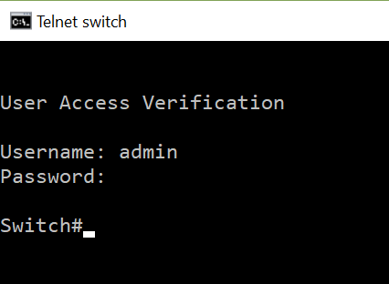
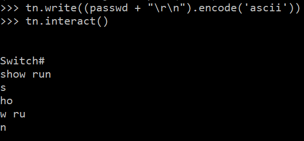

class: middle, center
# Coding in Python by copy-paste and Google search
# SSH to telnet proxy in 1 hour
### By Eugene Opredelennov
https://github.com/eoprede

---
# About this presentation

Targeted at beginner Python users.

Main goal - demonstrate that writing in Python is not hard even when dealing with some more complex issues.

I will be going through the process of creation of Telnet to SSH proxy, aimed to be used by network engineers.


---
# SSH to Telnet proxy - why bother?
Networking world doesn't change as fast as software one.
- There are still devices out there that simply don't support SSH.
- Some devices require initial connection via Telnet to enable SSH.
- Virtualized devices have console connection via Telnet

But Automation tools (like Ansible) are going along with times and mostly don't support telnet at all. And why should they?

---

# Python knowledge
Mostly basics, but you need to know of class override.
Very basic example:
```python
class Parent(object):
    def __init__(self):
        self.value = 5

    def get_value(self):
        return self.value

class Child(Parent):
    def get_value(self):
        return self.value + 1
```
Output:
```python
>>> p = Parent()
>>> p.get_value()
5
>>> c = Child()
>>> c.get_value()
6
```
---
#What is needed for proxy
Need 2 parts:
- Telnet client
- SSH server

---
# Telnet client
Python already has telnet client built in.
Quick Google search leads to this example:
```python
    tn = telnetlib.Telnet(self.target, self.telnet_port, timeout=10)
    tn.expect(["Login: ", "login: "], 5)
    tn.write(self.username + "\r\n")
    tn.expect(["Password: ", "password"], 5)
    tn.write(self.password + "\r\n")
    tn.write(self.config + "\r\n")
```
Also found in documentation page https://docs.python.org/2/library/telnetlib.html 
```
Telnet.interact()
Interaction function, emulates a very dumb Telnet client.
```

---
# Telnet client
Since there is expect code, I need to verify how login promt looks on network device. Testing with my Cisco 3750.
.center[]

---
# Telnet client
First attempt.
```python
import telnetlib

target = "1.1.1.1"
user = "admin"
passwd = "passwd"
telnet_port=23

tn = telnetlib.Telnet(target, telnet_port, timeout=10)
tn.expect(["Login: ", "login: ", "Username:"], 5)
tn.write(user + "\r\n")
tn.expect(["Password: ", "password"], 5)
tn.write(passwd + "\r\n")
tn.interact()
```

---
# Telnet client

Running code in python 3 produces error
```
TypeError: cannot use a string pattern on a bytes-like object
```
This is a very common error when trying to write python 2 and 3 compatible code.
In this case, telnetlib wants text as bytes. Change the code a little:
```python
tn.expect([b"Login: ", b"login: ", b"Username:"], 5)
tn.write((user + "\r\n").encode('ascii'))
tn.expect([b"Password: ", b"password"], 5)
tn.write((passwd + "\r\n").encode('ascii'))
```

---
# Telnet client

This new code works just fine.
Next step - see how methods are written.
https://github.com/python/cpython/blob/master/Lib/telnetlib.py

It looks like windows (which I am writing on) is actually using mt_interact() function. instead of interact()
```python
    def interact(self):
        """Interaction function, emulates a very dumb telnet client."""
        if sys.platform == "win32":
            self.mt_interact()
            return
```

---
# Telnet client
```python
    def mt_interact(self):
        """Multithreaded version of interact()."""
        import _thread
        _thread.start_new_thread(self.listener, ())
        while 1:
            line = sys.stdin.readline()
            if not line:
                break
            self.write(line.encode('ascii'))

    def listener(self):
        """Helper for mt_interact() -- this executes in the other thread."""
        while 1:
            try:
                data = self.read_eager()
            except EOFError:
                print('*** Connection closed by remote host ***')
                return
            if data:
                sys.stdout.write(data.decode('ascii'))
            else:
                sys.stdout.flush()
```

---
# Telnet client

Note regarding python conventions.

Function starting with _ (i.e. `_thread`) is generally not designed to be called directly.

And generally speaking multithreading with python should be done carefully - you can easily hang your system.

But since this is official library, I am going to assume they know what they are doing.

---
# Telnet client

Since I know that I will need to rewrite parts of the mt_interact function, I want to test that I fully understand how it works by making a small change.

I want to rewrite it to use print() and input()

---
# Telnet client

```python
class test_telnet(telnetlib.Telnet):
	def interact(self):
		self.mt_interact()
		return

	def mt_interact(self):
	    import _thread
	    _thread.start_new_thread(self.listener, ())
	    while 1:
	        line = input()
	        if not line:
	            break
	        self.write(line.encode('ascii'))

	def listener(self):
	    while 1:
	        try:
	            data = self.read_eager()
	        except EOFError:
	            print('*** Connection closed by remote host ***')
	            return
	        if data:
	            print(data.decode('ascii'))
```

---
#Telnet client
This almost works, but not quite. Terminal just repeats command that I typed back at me and then terminates. Also the output appears to be split between multiple lines.

.center[]

---
#Telnet client

There is a difference between `sys.stdin.readline()` and `input()` - former would include newline character, while latter one would not. Let me try and add it to the code.
```python
	def mt_interact(self):
	    import _thread
	    _thread.start_new_thread(self.listener, ())
	    while 1:
	        line = input()
	        if not line:
	            break
	        self.write((line+'\n').encode('ascii')
```

---
#Telnet client
Now I can interact with device via Telnet, but output is still split between lines.

It must be in listener() functiona and there isn't much in it, so it must be read_eager() call.

Looking at the telnetlib documentation, I find read_very_eager() function. If I use it, my code starts working as expected.

Note - I am not sure if this change is actually needed, but I never tested final product without it.

```python
	def listener(self):
	    while 1:
	        try:
	            data = self.read_very_eager()
	        except EOFError:
	            print('*** Connection closed by remote host ***')
	            return
	        if data:
	            print(data.decode('ascii'))
```
This is good enough, time to move on.

---
#SSH Server
This was supposed to be the harder part, but luckily there is a full blown paramiko demo ssh server example - https://github.com/paramiko/paramiko/blob/master/demos/demo_server.py

First thing - just run the code and verify that it works.

---
#SSH Server
After code is confirmed to be working, I am going to try and read though it.

Interesting fragments:
```python
    def check_auth_password(self, username, password):
        if (username == "robey") and (password == "foo"):
            return paramiko.AUTH_SUCCESSFUL
        return paramiko.AUTH_FAILED
```
It looks like username and password are easily available to us. Also we can easily control auth response.
---
#SSH Server
And in this fragment we can see how input and output are handled:
```python
    chan.send("\r\n\r\nWelcome to my dorky little BBS!\r\n\r\n")
    chan.send(
        "We are on fire all the time!  Hooray!  Candy corn for everyone!\r\n"
    )
    chan.send("Happy birthday to Robot Dave!\r\n\r\n")
    chan.send("Username: ")
    f = chan.makefile("rU")
    username = f.readline().strip("\r\n")
    chan.send("\r\nI don't like you, " + username + ".\r\n")
    chan.close()
```
So it looks like I can easily send data with `chan.send()` and receive data with `chan.makefile("rU").readline().strip("\r\n")`
---
#Putting it all together
Surprisingly, this is all the code I actually need. Now I just need to put it all together.

I am going to keep all the demo server file, except fo the dorky BBS part. I am also going to add to it my modified telnet class and code that I use to establish Telnet connections. 

But how do I pass data from ssh to telnet? Looking at the code, I just need to give my telnet code easy access to variable `chan` from SSH server. I am going to use cheap and dirty way - global variable.

---
#Putting it all together
```python
    def mt_interact(self):
        global chan
        import _thread
        _thread.start_new_thread(self.listener, ())
        while 1:
            f = chan.makefile("rU")
            line = f.readline()
            if not line:
                break
            self.write(line.encode('ascii'))

    def listener(self):
        global chan
        while 1:
            try:
                data = self.read_very_eager()
            except EOFError:
                print('*** Connection closed by remote host ***')
                return
            if data:
                chan.send(data.decode('ascii'))
```
---
#Putting it all together
To my surprise, this actually works. 

Obviously this is not very useful, as the script dies after telnet connection is killed and also it has hard-coded passwords for switch and SSH connections. So it does need a few tweaks.

---
# Letting user specifiy remote host
It makes sense to allow user connecting via SSH to specify which remote system they want to connect to. It can be fairly easily done by providing all the parameters in the username value. I have chosen a format of `username@system_to_proxy_to:port`

I am getting the username and password in the former authentication function and just setting them as global variables, always returning successful auth.
```python
    def check_auth_password(self, username, password):
        global user
        global passwd
        user = username
        passwd = password
        return paramiko.AUTH_SUCCESSFUL
```
---
# Letting user specifiy remote host
After that, I parse data out of username.
```python
            target = user.split("@")[-1]
            if ":" in target:
                telnet_port = int(target.split(":")[-1])
                target = ":".join(target.split(":")[:-1])
            else:
                telnet_port=23
            un = "@".join(user.split("@")[:-1])
```
I am taking extra care to accommodate usernames with @ symbol and potentially IPv6 addresses, even though I have no clue if IPv6 is supported by python's telnet function. But if it us, user will have to provide telnet port when connecting to IPv6 address.
---
#Letting server run until terminated
This requires to put a loop around SSH connection and then catch a KeyboardInterrupt exception to gracefully shut things down.

Unfortunately code block is too large to fit in the presentation screen, but full code can be viewed here: https://github.com/eoprede/ssh_to_telnet_proxy/blob/master/demo_server.py

---
class: middle, center
#Thank you